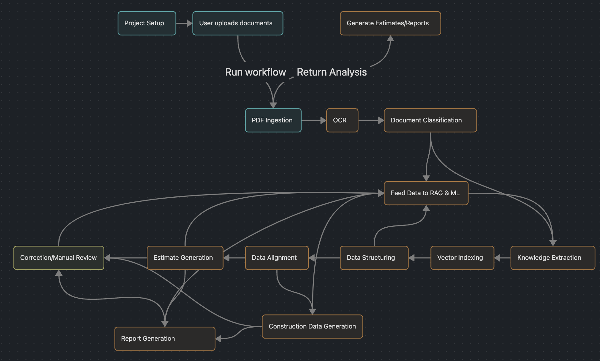

# Introduction
Hey Umer,

Thank you for the detailed feedback and for giving me access to the preview. I appreciate your transparency regarding where my background aligns with your vision and and where the gaps are.

I spent some time reviewing the application, exploring the platform and sample drawings and mapped out how I would bridge these gaps and architect the platform for scale and accuracy. You are absolutely correct, the core challenge here isn't  infrastructure but accuracy. However, without a rock solid, scalable, and observable infrastructure beneath it, even the best AI models will fail to deliver a reliable commercial product.

### Domain Knowledge
I do not have deep, hands on experience in construction drawings, operations, logistics or preconstruction workflows. However, entering complex specialized industries and rapidly taking technical ownership is a process I have executed repeatedly.

Throughout my career, I have successfully built platforms in domains where I initially had zero background including Healthtech (HIPPA compliant), Logistic, Accounting, Automated Parking, Hospitality and multi vendor restaurant operations.

I understand the added challenge at IntelCost is speed, so here is my plan on how to quickly bridge this gap;
- Build immediate operational understading by learning the foundational preconstruction workflows. By mapping out manual takeoff, scope checking and bid processes, I can start confidently leading the design and execution of general product workflows
- Establish a structured feedback channel with you. Through continuous domain discussions, I will develop deep understading of the platform's features, their specific business impact and exact pain points of our users

### Technical Expertise
Again like you pointed out, I do not have extensive experience building Vision & OCR models from scratch, although I have deep expertise developing Agentic AI workflows from my previous roles where I developed internal RAG based tooling for product & DevOps teams. If I join tomorrow, my approach to becoming the technical owner would be as an **Architect and Integrator**.
- I will start by leveraging existing cloud model orchestration platforms and frontier models to speed up development
- I will immediately recruit specialized talent for custom Vision, OCR, and ML training
- I will personally lead the system design & architecture, data pipelines, cloud infrastructure, AI evaluation workflows and the rolling migration to custom models

# Technical

I have mapped my current and propsed technical understanding of the platform into three sections;

### 1. Inputs
• Project Specifications
• Construction drawings
• Geotechnical reports
• Addenda
• Subcontractor quotations
• Product data sheets

### 2. Components
 - **OCR & Vision:** Specialized models for document data extraction & classification
- **LLM/ML Models:** For understading the contents of documents & transforming them into structured data
- **Data Processing:**  To categorize structured data to relevant system modules & trade classification
- **RAG:** Project and system level knowledge base to act as a smart Assistant/Query tool for quick operations
- **Reporting:**
	- Estimate Reports
	- Scope Gap reports
	- Trade Scope Reports
	- Subcontractor Quote Analysis
	- Assembly Based Estimating
- **AI evaluation frameworks & workflows:** To capture user correction, manual human review and labelled data

### 3. Dependencies
- Specialized OCR, Vision & ML models
- Cloud model orchestration platform (AWS Bedrock)
- Event bus (e.g Kafka or RabbitMQ)
---
### System Design
To process millions of multi format pages annually (including unstructured specifications and large drawings), I propose;
-  Because 80% of our workflow involves AI models performing resource heavy operations , I would utilize an event driven, distributed, serverless architecture to keep operational and scaling costs lean and keeping the core system responsive
- AI workflows are time consuming by nature. I will add data streaming to log realtime responses back to the user providing a responsive UX
- Build specialized models for OCR, Vision & classification to have better visibility on each model's accuracy, usage, operational costs and improvement by training metrices
- Add observability early on to keep track of system performance, profiling opportunites, usage analysis and for proactive monitoring
- Build evaluation and feedback loop for models injesting system & human labelled data to improve accuracy over time

#### Achieving the Highest Possible Accuracy (ML over LLM)
Relying solely on LLMs and prompts is highly risky for estimating, a single hallucinated zero or decimal shift can destroy a contractor's profit margins or result in a disqualified bid. So here is my plan,
- Start with LLMs to prototype features rapidly, from the input and output of these LLMs, we start building our custom dataset
- Every time an estimator corrects AI generated data, we capture that correction and feed to that dataset
- Use our labeled data to train and fine tune smaller, highly accurate, and much cheaper specialized models (e.g fine tuned models for Trade Classification & CSI Division Tagging). Then eventually migrate away from those unpredictable models

#### Contingency Plan
If OpenAI, Anthropic, or Google ceased to exist tomorrow, to ensure IntelCost is operational:
- We must not write provider locked code. All LLM calls will route through an orchestration layer (AWS Bedrock) allowing us to hot swap providers instantly
- By saving our inputs, outputs and user corrections, we build a private dataset. If frontier models disappear, we can transition our pipelines to open weights models selfhosted on cloud instances fine tuned on our proprietary dataset

### Execution & Roadmap 

#### Platform Assessment & Initial Feedback
The current prototype is an impressive showcase of the platform. However, there are a few pain points to address:
 - It's cumbersome to wait with no visible progress, we should improve UX when models are performing their operations in background, report the progress back to users, what stage it's exactly at and how much longer to expect
- Give users the ability to see why AI made a decision. For example, hovering over an estimated price to highlight the exact sentence in the PDF specifications or the area on the drawing sheet it pulled a number from
- Improve UI/UX of CSI division breakdown section, it looks like an Excel sheet now
- Add an AI assistant that can act on behave of users adding, querying and visualizing data from user's prompts

#### Estimated Time to Commercial Launch
Assuming we focus on a narrow MVP slice, I belive it will take 2 months of scoped and iterative work to implement sufficiently accurate document understanding workflows, complete the data processing pipelines, add report generation and develop cloud infrastructure.

#### Development Workflow & Tooling
- I highly advocate for Cursor and Claude Code to quickly prototype and develop core components, automated code reviews, write architecture and code documentations, add unit and integration tests
- I will emphasize adding comprehensive testing for data pipeline, conduct strict PR reviews, add staging preview environments and CI/CD pipelines for automated code quality checks and deployments
- Use Agile based iterative & collaborative SDLC workflow

# Business

#### Market Research Analysis
I took the opportunity to conduct a little market research for existing competition. Small but highly specialized niche tools already exist providing superior accuracy because their ML models and parsing pipelines are trained on massive historical construction datasets

#### The Biggest Technical Risks (Next 24 Months)
- If we are not able to quickly build and train own custom dataset, because LLMs are error prone and hallucination prone when handling dense documents, relying on them long term creates a severe risk. If the system produces incorrect estimation, takeoff or scope gap reports, we will lose the trust of our customers.
- Construction estimation(in my limited knowledge) is zero margin for error process. If our models are only 85% accurate, the manual effort required for an estimator to double check every output makes our product a net negative utility. We must achieve 98%+ accuracy on core workflows to build a sustainable SaaS product
> 	The solution, as described above is to hire specialists early on and start training on our propriatery data to achieve highest possible accuracy
- To beat competition, we must meet contractors where they already live. Rather than forcing them to transition to another isolated web application, we should build **bi-directional integrations** directly with existing platforms and tools they already use to create bids, drawings, subcontractor quotes and specs. By functioning as a seamless intelligence layer ingesting documents directly from their workflows, processing them and returning analyses straight to their existing tools, we offer frictionless value that independent solutions cannot match.

#### Biggest Mistakes Founders Make with AI Products
- Assuming LLMs can solve every problem out of the box with "better prompts." This results in huge costs (more context feeded, expensive it gets), latency issues and unpredictability
- Getting vendor locked by building for specific frontier model providers
- Forgetting that software is only useful if it fits into existing tools and trying to build all in one hubs. To win the market, IntelCost must seamlessly integrate into the tools already live 
- AI by it's nature is an unpredictable blackbox, launching an AI product without observability on how a prompt was constructed, measureable accuracy metrices, how much it cost and why it failed

# Job
- I prefer a fixed fulltime monthly salary of 650K PKR along with equity options.
- Regarding work mode, I can start with hybrid work but only one week per month. Eventually, I plan to move to Islamabad with my family in 6 months or so, then I can be in office fulltime.
